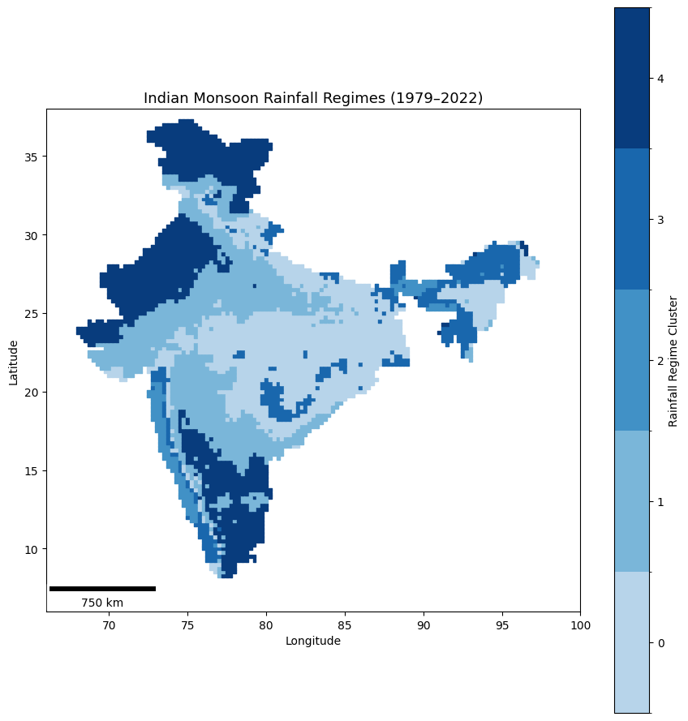

# Indian Monsoon Rainfall Regimes using Machine Learning

## Overview
This project applies unsupervised machine learning to identify spatial rainfall regimes across India using the IMD 0.25° gridded rainfall dataset (1979–2022).

## Dataset
- Source: India Meteorological Department (IMD)
- Resolution: 0.25° grid
- Period: 1979–2022
- Season analyzed: JJAS (June–September)

## Features
The following climatological rainfall statistics were calculated for each grid cell:
- Mean rainfall
- Standard deviation
- 95th percentile rainfall
- Wet-day frequency (rainfall > 1 mm)

## Method
K-Means clustering was applied to classify rainfall regimes across India.

## Result
The clustering identifies five distinct rainfall regimes across India.

## Tools
Python, Xarray, Scikit-learn, GeoPandas, Matplotlib
